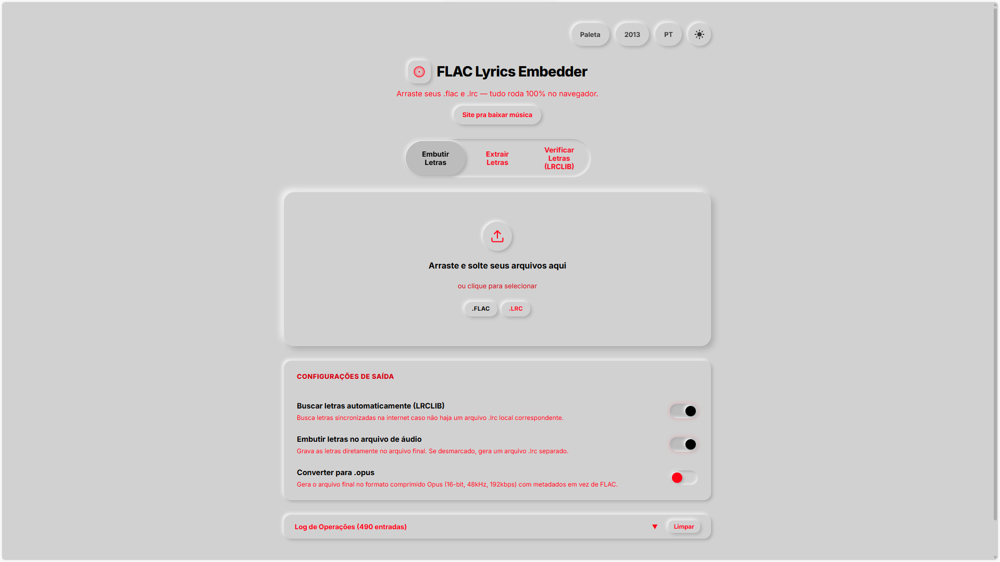
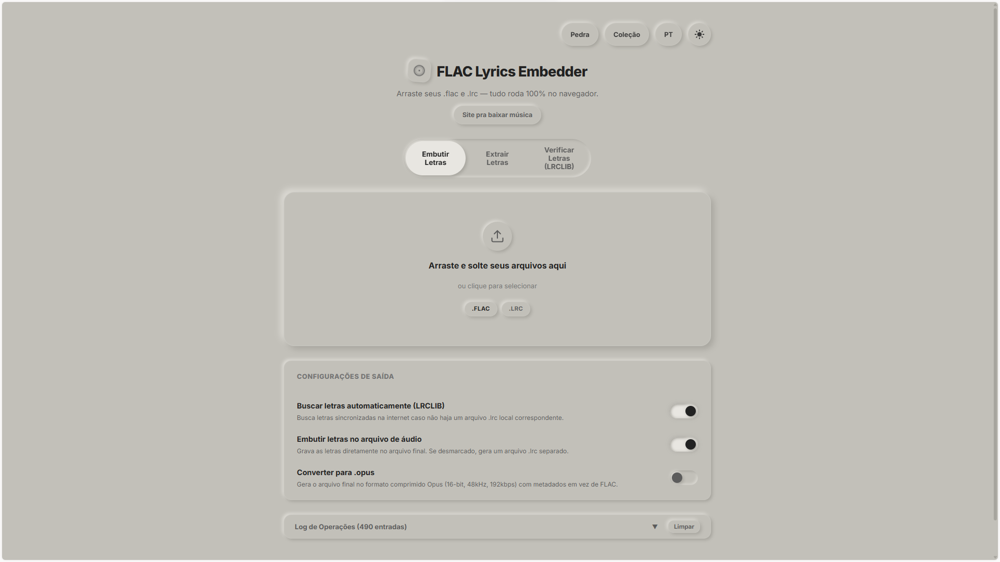
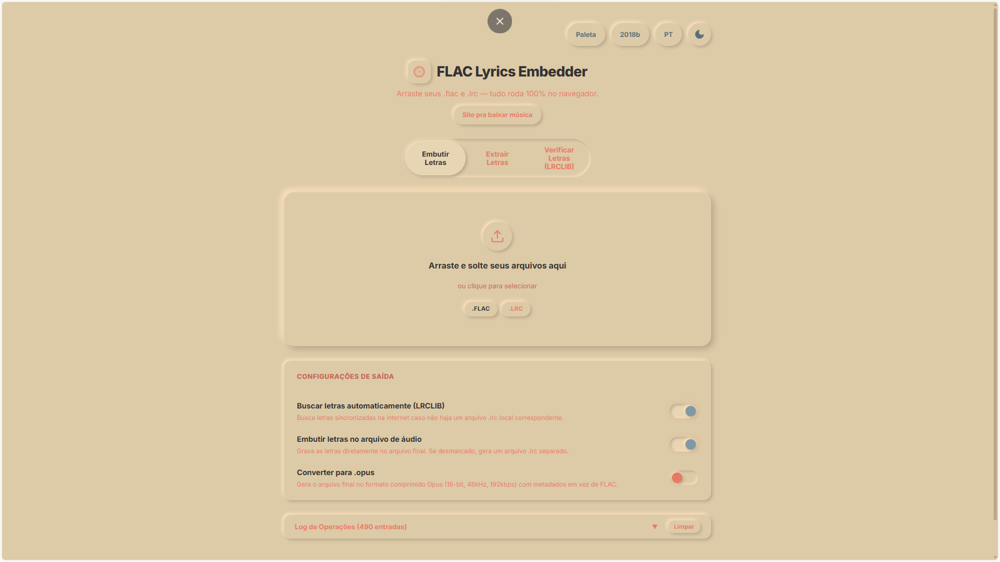
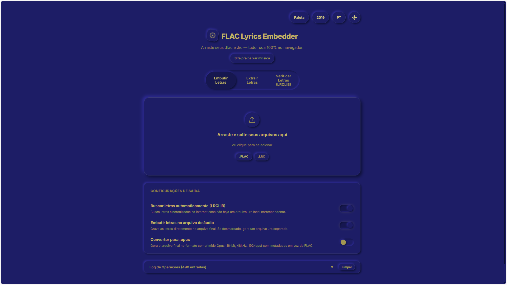
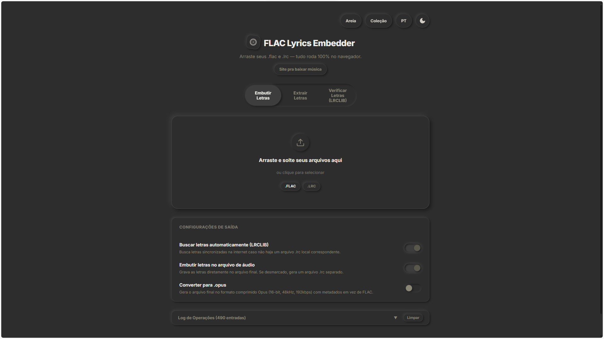

# FLAC Lyrics Embedder & Converter (Web + Local Engine)

Este projeto é uma ferramenta de alta performance desenvolvida para gerenciar metadados de arquivos de áudio, com foco em sincronização de letras temporizadas (`.lrc`), preservação de capas de álbuns (cover art) e conversão otimizada de áudios de alta fidelidade **FLAC** para o codec **Opus (OGG)**.

O sistema foi arquitetado utilizando duas engines independentes e complementares:
1. **Engine Web (WebCodecs Nativo)**: Codificação e muxing executados diretamente no navegador do usuário.
2. **Engine Local (Python + FFmpeg)**: Conversão em lote concorrente e automatizada diretamente nos diretórios do sistema operacional.

---

## 🎨 Interface e Paletas de Cores

O aplicativo possui uma interface visual premium e responsiva construída em **Neumorfismo (Soft UI)**, oferecendo suporte nativo para múltiplos esquemas de cores e temas estilizados inspirados em diferentes eras e paletas conceituais:

### 🔴 Yeezus (Paleta Vermelha)


### ⛰️ Pedra (Paleta Cinza)


### 🌅 Kids See Ghosts (Paleta Areia/Peach)


### 🔵 Jesus Is King (Paleta Azul)


### 🕶️ Onyx (Dark Mode)


---

## 📂 Estrutura do Projeto

O código-fonte é organizado nos seguintes módulos e componentes principais:

```
├── src/                      # Frontend e Engine Web
│   ├── flac.ts               # Parser binário para análise da estrutura de blocos FLAC
│   ├── i18n.ts               # Sistema de internacionalização e suporte multi-idiomas
│   ├── main.ts               # Orquestração da interface e monitoramento (polling) do servidor local
│   ├── opus.ts               # Muxer Ogg e pipeline de codificação WebCodecs
│   └── style.css             # Interface visual premium com temas adaptativos
│
├── conversor/                 # Engine de Conversão Local (Python + FFmpeg)
│   ├── config.py             # Gerenciamento de variáveis globais e persistência de dados
│   ├── config.json           # Armazenamento persistente de caminhos de entrada e saída
│   ├── convert.py            # Servidor HTTP REST de API e processamento concorrente
│   ├── logger.py             # Registro de logs thread-safe (sucessos, falhas e pulados)
│   ├── validator.py          # Validador de integridade de áudio via ffprobe
│   └── logs/                 # Diretório contendo os históricos de execução
│
├── index.html                # Página web estrutural e DOM do aplicativo
├── package.json              # Mapeamento de dependências web
└── tsconfig.json             # Regras do compilador TypeScript
```

---

## 🛠️ Detalhes de Funcionamento e Arquitetura

### 1. Engine Local (Servidor de API Python & CLI)

Projetada para processamento em larga escala sem uso de pacotes externos no ambiente Python (utilizando apenas a biblioteca padrão e binários do sistema):

*   **Processamento Assíncrono e Paralelo**:
    O servidor executa as rotas HTTP em uma thread principal e inicia as conversões em threads secundárias gerenciadas por um `ThreadPoolExecutor` (`MAX_WORKERS` controlado). O escaneamento de arquivos flac é feito de forma assíncrona para que a interface web nunca trave ao lidar com diretórios gigantescos.
*   **Extração e Parsing Binário da Capa**:
    A imagem de capa é extraída decodificando a estrutura de blocos do arquivo FLAC de origem em busca do bloco de metadados correspondente ao tipo `6` (`PICTURE`). O payload da imagem é codificado em `base64` e injetado nos Vorbis Comments do contêiner Opus através da tag `METADATA_BLOCK_PICTURE`.
*   **Pipeline de Metadados via Arquivos `.meta`**:
    Para contornar o limite de tamanho de argumentos do terminal do Windows ao lidar com metadados extensos (capas em alta resolução ou letras com milhares de caracteres), o sistema escreve dinamicamente as tags Vorbis, a capa e a letra temporizada (lida e decodificada de arquivos `.lrc`) em um arquivo temporário no formato de metadados do FFmpeg (`ffmetadata`). Esse arquivo é limpo de forma garantida (`finally`) após a conclusão da conversão.
*   **Validação Automatizada de Saída**:
    Para garantir que nenhum arquivo Opus corrompido seja gravado em disco, o script de validação executa o `ffprobe` e analisa a resposta em formato JSON para garantir que o arquivo de destino possui tamanho, fluxo de áudio Opus válido e duração detectável. Arquivos parciais com erros são imediatamente deletados.

### 2. Engine Web (WebCodecs & JavaScript Muxing)

Permite converter áudio diretamente no lado do cliente (browser) sem tráfego de rede para servidores externos:

*   **Parsing Binário no Navegador (`flac.ts`)**:
    Analisa os bytes de arquivos FLAC selecionados pelo usuário para decodificar os blocos de metadados, extrair informações de imagem e comentários Vorbis diretamente na memória.
*   **Codificação Nativa (`opus.ts`)**:
    Utiliza as APIs nativas `AudioEncoder` (WebCodecs) para processar o áudio PCM decodificado do FLAC em frames Opus compactados, organizando-os em páginas Ogg multiplexadas sequencialmente com cálculo manual de somas de verificação CRC32.

### 3. Persistência de Diretórios e Progresso
*   As pastas de origem e destino configuradas na interface web são persistidas em um arquivo JSON local (`conversor/config.json`) pelo servidor Python, mantendo os caminhos configurados mesmo que o servidor ou o computador sejam reiniciados.
*   O progresso da conversão é exposto via API em tempo real (`/api/status`), detalhando a porcentagem global, faixa atual sob conversão, quantidade restante, logs instantâneos do FFmpeg e contador de falhas.

---

## 🧪 Estrutura de Logs e Diagnósticos
O sistema grava diagnósticos de execução automaticamente na pasta `conversor/logs/`:
*   `success.log`: Caminhos absolutos dos arquivos convertidos com sucesso.
*   `errors.log`: Erros detalhados de validação ou do terminal stderr do FFmpeg.
*   `skipped.log`: Arquivos que foram ignorados por já estarem presentes na pasta de saída (prevenindo reprocessamento inútil de áudio).
